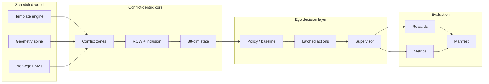

# Behavioral Decision Benchmark — Comprehensive Redesign

**Document purpose.** This specification captures the end-to-end redesign of the interaction benchmark so that it **isolates behavioral decision making from low-level control**, uses **template-driven conflict scheduling**, and surfaces **explicit right-of-way (ROW) and interaction metrics**. The benchmark is intended for training and evaluating policies that choose *when* and *whether* to commit, yield, creep, or abort—rather than policies that micromanage continuous steering and throttle in cluttered urban scenes.

**Version note.** This document is the authoritative design reference for the behavioral decision benchmark. Implementation is aligned with the file layout in Section 17; Section 18 records completion status.

---

## 1. Executive Summary

The redesign reframes the benchmark around **behavioral decision making**: discrete or latched high-level actions that express intent relative to **conflict geometry**, **scheduled adversarial or cooperative actors**, and **clear ROW semantics**. Low-level trajectory tracking, lane-keeping finesse, and dense perception stacks are deliberately de-emphasized so that learning signal concentrates on **commitment timing**, **gap acceptance**, **deference under ambiguity**, and **safe recovery** when assumptions fail.

**Central thesis.** Many driving benchmarks conflate *perception*, *planning*, and *control* into a single scalar success metric. This redesign **separates the decision layer** by:

- Providing a **simplified single-lane backbone** with well-defined **conflict zones** where interactions occur on schedule.
- Driving variability through **template families** that specify ETA bands, actor roles, and expected ego behavior—not through random map clutter.
- Encoding **ROW obligations** and **intrusion** directly in state, reward, and metrics so that models cannot “win” by aggressive tailgating alone.
- Using **latched ego actions** (STOP, CREEP, YIELD, GO, ABORT) so that evaluation measures **policy-level choices** rather than frame-to-frame control jitter.

**Outcomes for research.** The benchmark supports reproducible studies on **decision quality under time pressure**, **conservative vs. opportunistic policies**, **failure modes when ROW is violated by others**, and **smoothness of behavioral transitions**—each measurable with dedicated metrics (Section 13).

---

## 2. Scope and Research Intent

### 2.1 Primary goal

The **primary goal** is to train and evaluate agents that **select appropriate behavioral responses** at conflict onset and maintain coherent commitments until clearance or controlled termination. Success means:

- **Safety:** No preventable collisions within the ego’s controllable envelope; minimal exposure when others intrude.
- **Efficiency:** Reasonable progress through the scenario without indefinite hesitation when ROW and gaps permit.
- **Decision quality:** Actions align with template-defined expectations and ROW rules.
- **Smoothness:** Avoid oscillation between incompatible latched modes (e.g., GO ↔ STOP thrashing).

### 2.2 Ego responsibilities

The ego is responsible for:

1. **Recognizing conflict onset** from the 88-dimensional conflict-centric state (Section 11).
2. **Choosing a latched action** (Section 10) appropriate to ROW, closing speed, and time-to-conflict.
3. **Maintaining commitment** until clearance, abort conditions, or episode termination—subject to hard safety overrides where implemented.
4. **Signaling deference** (YIELD, CREEP) when ROW is ambiguous or ceded, and **asserting GO** only when the schedule and geometry support it.
5. **Executing ABORT** when commitment is no longer valid (e.g., sudden intrusion, impossible gap).

### 2.3 Non-responsibilities (explicitly out of scope)

To isolate behavioral decisions, the ego is **not** primarily scored on:

- **Sub-centimeter path tracking** or stylistic lane centering away from conflict zones.
- **Full-stack perception** in unstructured environments; sensing is abstracted into the state vector and zone flags.
- **Long-horizon route planning** across arbitrary road graphs; the network is a **single-lane spine** with localized branches at conflicts.
- **Negotiation protocols** beyond the FSM abstractions for non-ego actors (Section 9); there is no open-ended human-style negotiation.
- **Hardware-in-the-loop realism**; the focus is **algorithmic** decision quality under known templates.

This scope boundary is intentional: it **channels learning capacity** toward **when to act**, not **how to draw a perfect spline**.

---

## 3. Core Redesign Principles

Eight principles govern every subsystem. Together they enforce the key message: **template-driven conflicts**, **explicit ROW**, and **decision-centric evaluation**.

| # | Principle | Implication |
|---|-----------|-------------|
| **P1** | **Conflict-first geometry** | The road exists to host **scheduled interactions**; straight free-flow segments are minimal. |
| **P2** | **Template-driven scheduling** | Variability enters through **templates and ETA bands**, not uncontrolled procedural noise. |
| **P3** | **ROW as first-class signal** | ROW is in state, reward, and metrics—not an afterthought inferred from positions alone. |
| **P4** | **Latched ego semantics** | Actions represent **commitments**; churn is penalized and measured. |
| **P5** | **Separation from low-level control** | High-level decisions map to bounded execution primitives; the benchmark does not reward control virtuosity. |
| **P6** | **Observable intrusion** | When others violate expectations, the ego state and rewards reflect **intrusion** and **forced braking**. |
| **P7** | **Reproducible episodes** | Pre-roll, onset, and termination are **deterministic given seed and template**. |
| **P8** | **Multi-metric success** | No single scalar collapses safety and efficiency; **dashboards** report ROW, conflict, and smoothness. |

**P1–P3** ensure the benchmark tests **decisions under known interaction structure**. **P4–P6** prevent policies from gaming a naive progress reward. **P7–P8** support **scientific comparison** across methods.

### 3.1 Principle P1 — Conflict-first geometry (expanded)

**Statement.** The road network is not an end in itself; it is a **carrier** for scheduled, interpretable interactions.

**Design consequences.** Scenario authors minimize **low-information** cruising distance except where needed for speed stabilization or false-alarm tests. Any geometry change must preserve **a single dominant decision point** per episode variant (or an explicit ordered chain documented in the scenario manifest). This keeps attribution clear: when a policy fails, reviewers can point to **which conflict** and **which template phase** caused it.

### 3.2 Principle P2 — Template-driven scheduling (expanded)

**Statement.** Stochasticity is **engineered**, not ambient.

**Design consequences.** Actor timing is drawn from **ETA bands** attached to templates, with seeds recorded in manifests. Procedural clutter (random parked cars, unrelated pedestrians) is avoided because it **dilutes** the interaction label and makes ROW metrics ambiguous. When additional noise is required for robustness studies, it enters as **explicit template parameters** (e.g., widened \(T_{\max}\)), not unlogged simulator defaults.

### 3.3 Principle P3 — ROW as first-class signal (expanded)

**Statement.** Right-of-way is **observable** to the policy and **graded** in rewards and metrics.

**Design consequences.** The 88-dimensional state includes **ROW obligation** features independent of raw positions; rewards penalize **rule violations** even under near-miss outcomes. This closes a common loophole: agents that **bully** through gaps without collision still receive **negative ROW signal**, enabling research on **courtesy**, **legality proxies**, and **defensive** driving rather than purely collision-avoidance twitching.

### 3.4 Principle P4 — Latched ego semantics (expanded)

**Statement.** Actions are **commitments**, not per-frame impulses.

**Design consequences.** Metrics distinguish **policy-level** mode changes from low-level tracking corrections. Thrashing between **GO** and **STOP** is measurable and penalized unless justified by **intrusion events** logged in the environment. This aligns training with how human supervisors judge behavior: **decisive** vs. **hesitant** vs. **erratic**.

### 3.5 Principle P5 — Separation from low-level control (expanded)

**Statement.** The benchmark should not require nor reward **centimeter-perfect** continuous control.

**Design consequences.** High-level commands map through a **thin execution adapter** with bounded dynamics. Evaluation reports may include **execution error** separately from **decision error** when supervisors intervene. Research conclusions about **decision quality** must cite **latched-action metrics**, not only trajectory aesthetics.

### 3.6 Principle P6 — Observable intrusion (expanded)

**Statement.** When the world violates the ego’s legitimate envelope, the agent **sees** it and **pays** for ignoring it.

**Design consequences.** Intrusion scalars, time since intrusion, and **forced brake** detectors connect perception-like abstractions to **semantic** outcomes. Policies cannot treat cross traffic as background noise; intrusion features **spike** with clear semantics tied to template phases.

### 3.7 Principle P7 — Reproducible episodes (expanded)

**Statement.** Given **seed**, **scenario ID**, and **config version**, episode timelines are **stable**.

**Design consequences.** Manifests store these triples; CI regression uses fixed seeds. Any nondeterminism (physics solver, floating drift) is **bounded and documented**; where simulators are inherently noisy, **envelope tests** replace single-point equality checks.

### 3.8 Principle P8 — Multi-metric success (expanded)

**Statement.** Safety alone is insufficient; **efficiency without ROW violations** and **smooth commitments** are part of scientific success.

**Design consequences.** Dashboards (see `experiments/dashboard.py` in the file map) aggregate **four families** of metrics (Section 13). Publications should report **vectors** of outcomes, not a single hacked scalar. This matches the benchmark’s thesis: **behavioral** quality is **multi-dimensional**.

---

## 4. Architecture Overview — Six Pillars

The implementation rests on **six pillars**. Each pillar has a narrow interface to the others, which keeps abstractions stable as individual modules evolve.

### Pillar A — Scenario catalog and IDs

A versioned catalog maps **scenario IDs** (e.g., `1a`–`4`) to **geometry snippets**, **template family**, **non-ego spawn rules**, and **evaluation hooks**. Scenarios are **compositional**: the same lane graph can host different templates.

### Pillar B — Template engine

The **template engine** instantiates **scheduled events**: actor appearances, intended paths through conflict zones, nominal speeds, and **ETA bands** (earliest / nominal / latest time to conflict). Templates define **expected ego behavior** for curriculum labeling and auxiliary supervision if desired.

### Pillar C — Conflict zone model

**Conflict zones** are annotated regions along the single-lane spine. Each zone has:

- **Entry / exit** stationing or arc-length bounds.
- **ROW rules** (who must yield by default).
- **Intrusion detectors** (occupancy vs. reservation).
- **Clearance criteria** for committing GO or releasing YIELD.

### Pillar D — Non-ego actor controllers

Vehicles, motorcycles, and pedestrians run **finite-state machines (FSMs)** keyed to template phase. They are **not** full RL agents; their behavior is **repeatable** and **stress-tests** ego decisions.

### Pillar E — Ego decision interface

The ego policy observes the **88-dimensional state** and emits **latched actions** with explicit **onset**, **commitment**, and **abort** rules. A thin adapter may map actions to simulator commands without expanding the action space into continuous control.

### Pillar F — Rewards, metrics, and validation gates

**Reward terms** (Section 12) decompose into ROW adherence, conflict handling, progress, and smoothness penalties. **Metrics** (Section 13) feed **validation gates** (Section 15): manual checks, quantitative targets, and a **rule baseline** for regression.

**Cross-cutting concern:** Logging emits a structured **evaluation manifest** (Section 14) per run so that aggregates are reproducible.

### 4.1 Control and data flow (reference)

The following diagram summarizes how information moves from **template scheduling** to **metrics and manifests**. The key message is visible in the center path: **conflict zones** and **ROW** sit between perception-like state features and **decision** evaluation—not off to the side as optional logging.



**Read order for implementers.** Start from `template_engine.py` and `geometry_spine.py` to construct zones (`conflict_zones.py`), then `state_88d.py`, then `ego_actions.py` + `supervisors.py`, then `rewards.py` and `metrics.py`. Training and evaluation scripts consume only the **documented** observation and action contracts.

---

## 5. Geometry and Network

### 5.1 Simplified single-lane backbone

The drivable network is intentionally **minimal**:

- One **primary lane** (the spine) with **uniform nominal width** and gentle curvature except at conflict loci.
- **Short connectors** or **merge lips** where template actors enter the ego’s relevant field.
- **No arbitrary grid** of intersections; each scenario places **one primary conflict** or a **small ordered sequence** (e.g., staggered cross-traffic) per episode variant.

**Rationale.** Multi-lane weaving and complex topology dilute the credit assignment for a single yield/go decision. The spine keeps **causal structure** clear: the ego approaches a **known conflict region** with **scheduled participants**.

### 5.2 Conflict zones

Each conflict zone \(Z_k\) is defined by:

- **Spatial extent:** interval along the spine parameter \(s \in [s_k^{\text{in}}, s_k^{\text{out}}]\) plus lateral envelopes for cross paths.
- **ROW model:** static rule table + template overrides (e.g., unprotected left vs. pedestrian scramble).
- **Schedule binding:** which template event anchors ETA to \(Z_k\).
- **Clearance definition:** e.g., time-headway, occupancy, and “tail clear” flags for cross traffic.

**Conflict-centric state** (Section 11) is built from **zone-local** features: time-to-enter, predicted occupancy, ROW flags, and ego commitment status.

### 5.3 Visibility and occlusion (abstracted)

Where relevant, **occlusion flags** are **binary or graded** inputs derived from template phase—not from pixel-level rendering. This keeps the benchmark **decision-focused** while still allowing “surprise” intrusions per template.

---

## 6. Episode Lifecycle

Every episode follows a **shared lifecycle** so that learning and evaluation align on the same temporal phases.

### 6.1 Pre-roll

**Purpose:** Stabilize the simulator, establish speed, and align the ego to the spine before **decision-relevant** signals activate.

- Ego travels under **cruise policy** or fixed setpoint.
- Template actors may be **dormant** or **off-screen** per scenario.
- **No decision reward** is accumulated (or a neutral holding term only), preventing credit to random pre-conflict behavior.

### 6.2 Decision onset

**Trigger:** Ego crosses **onset gate** \(g_{\text{on}}\) (distance or time to conflict zone below threshold) *or* template **T_on** fires.

- **State stream** switches to full **88-dim** conflict-centric features.
- **ROW and ETA band** indicators become active.
- **Expected behavior hint** (for curriculum or logging) may be exposed to trainers—not necessarily to test policies.

### 6.3 Commitment

The ego selects a **latched action** (Section 10). **Commitment** means:

- The action persists until **clearance**, **template phase transition**, or **ABORT** eligibility.
- Intermediate micro-adjustments within the same latch class are allowed at the execution layer but do not constitute a new decision for metrics.

**Commitment integrity** is measured: frequent incompatible switches incur **smoothness** penalties (Section 12–13).

### 6.4 Clearance

**Clearance** is zone- and template-specific:

- **Spatial clearance:** conflict polygon free per occupancy rules.
- **Temporal clearance:** minimum time since last intrusion.
- **ROW clearance:** obligation satisfied (e.g., cross traffic has ROW until tail clear).

Upon clearance, **GO** may be rewarded if consistent with ROW; **YIELD** may release to **CREEP** or **GO** per scenario script.

### 6.5 Termination

Episodes end with a **labeled outcome**:

- `SUCCESS_CLEAR` — passed conflict with no safety violation and acceptable efficiency.
- `SUCCESS_ABORT` — safe abort when template demands.
- `FAIL_COLLISION` — contact or penetration beyond tolerance.
- `FAIL_RULE` — ROW violation by ego (even if no collision).
- `TIMEOUT` — hesitation or stall beyond limit.
- `TRUNCATED` — engineering stop (e.g., simulator limit).

Termination drives **hard metrics** and **curriculum advancement** (Section 14).

---

## 7. Template Families

Templates are the **primary source of diversity**. Each family specifies **ETA bands**, participating actors, ROW context, and **expected ego behavior** (for training curricula and qualitative review). **Nine families** are defined below.

### Family T1 — Unprotected gap acceptance (crossing vehicle)

| Field | Specification |
|-------|-----------------|
| **ETA band** | \(T_{\text{ego}} \in [T_{\min}, T_{\text{nom}}, T_{\max}]\) seconds to conflict point at nominal speeds; band width stresses early vs. late arrival. |
| **Actors** | One crossing vehicle (FSM: approach, commit cross, clear). |
| **ROW** | Context-dependent: ego may have **de facto ROW** only after cross vehicle clears; templates vary who is legal priority. |
| **Expected ego** | **YIELD** or **STOP** if gap insufficient; **GO** after clearance; **CREEP** only if template encodes visibility-limited advance. |

### Family T2 — Staggered double threat

| Field | Specification |
|-------|-----------------|
| **ETA band** | Two nested bands: **near** and **far** crossers with offset \(\Delta T\). |
| **Actors** | Two vehicles (FSM: sequential commit). |
| **ROW** | Ego must respect **both** clear windows; first crosser may obscure second. |
| **Expected ego** | Hold through first threat; **GO** only when **compound clearance** holds; **ABORT** if second surges. |

### Family T3 — Motorcycle lane-filter / squeeze

| Field | Specification |
|-------|-----------------|
| **ETA band** | Narrow band: motorcycle **closing fast** along adjacent path. |
| **Actors** | Motorcycle FSM: filter-in, pass-through, exit. |
| **ROW** | Often **ego must yield** lateral space; intrusion risk high. |
| **Expected ego** | **YIELD** / **STOP** to avoid squeeze; no **GO** until lateral separation OK. |

### Family T4 — Pedestrian scramble (two-stage)

| Field | Specification |
|-------|-----------------|
| **ETA band** | Ped **enter** and **exit** sub-bands. |
| **Actors** | Pedestrian FSM: wait, enter crosswalk, traverse, clear. |
| **ROW** | Pedestrian priority in crosswalk; template may add **late runner**. |
| **Expected ego** | **STOP** at limit line; **CREEP** only if law/template allows and clearance partial; **GO** at full clear. |

### Family T5 — Occluded approach (surprise intrusion)

| Field | Specification |
|-------|-----------------|
| **ETA band** | **Early hidden** phase then **late visible** phase with compressed \(T_{\text{react}}\). |
| **Actors** | Vehicle or ped emerging from occlusion volume. |
| **ROW** | Ego may have nominal ROW until intrusion becomes visible; **moral** expectation to **ABORT** or **STOP**. |
| **Expected ego** | **ABORT** or hard **STOP**; penalize **GO** through known occlusion without caution (per curriculum stage). |

### Family T6 — Merge assist / cooperative gap

| Field | Specification |
|-------|-----------------|
| **ETA band** | Merge vehicle targets slot; ego adjusts in time. |
| **Actors** | Vehicle FSM: signal, accelerate/decelerate into merge. |
| **ROW** | Often **merging vehicle yields**; template flips to **ego yields** in hostile variant. |
| **Expected ego** | **GO** when merge yields; **YIELD** when ego must open gap; smooth **CREEP** acceptable. |

### Family T7 — Red-light runner (signalized abstraction)

| Field | Specification |
|-------|-----------------|
| **ETA band** | Signal phase timer vs. runner **early/late** entry. |
| **Actors** | Cross vehicle violates interval. |
| **ROW** | Ego had ROW; runner **intrudes**. |
| **Expected ego** | **STOP** / **ABORT**; reward **defensive** correctness over progress. |

### Family T8 — Stationary obstruction in lane

| Field | Specification |
|-------|-----------------|
| **ETA band** | Time to encroach on stopped object. |
| **Actors** | Static or slow vehicle; optional passer in adjacent abstract lane. |
| **ROW** | Ego must not collide; may require **STOP** then **CREEP** if template provides bypass envelope. |
| **Expected ego** | **STOP** before conflict; **CREEP** only if side clearance exists; else **YIELD** indefinitely until replan (timeout metrics). |

### Family T9 — Repeated micro-conflicts (stress test)

| Field | Specification |
|-------|-----------------|
| **ETA band** | Train of small events \(\{T_i\}\) with small gaps. |
| **Actors** | Mixed FSM cadence (ped + bike + car). |
| **ROW** | Alternating priority to test **latch stability**. |
| **Expected ego** | Sequence of **YIELD**/**GO** without thrash; **smoothness** heavily weighted. |

**Template balance** (Section 14) ensures no single family dominates the training distribution unless a curriculum stage explicitly emphasizes it.

---

## 8. Per-Scenario Design (1a Through 4)

Scenarios instantiate geometry + template families for reproducible benchmarks. IDs are stable across code, logs, and papers.

### Scenario 1a — Primary unprotected crossing (baseline)

- **Geometry:** Straight approach; single conflict zone at labeled intersection abstraction.
- **Template:** T1 with **moderate** ETA band; one crossing vehicle.
- **Stress:** Clean measurement of **basic yield/go** timing.
- **Success profile:** **YIELD**/**STOP** then **GO** after clearance; no ROW violation.

### Scenario 1b — Tight ETA (aggressive arrival)

- **Geometry:** Same as 1a; shortened approach or higher cruise speed.
- **Template:** T1 with **narrow** ETA band biased toward **late decision pressure**.
- **Stress:** Tests **last-second** YIELD vs. unsafe GO.
- **Success profile:** Hard **STOP** or **YIELD**; efficiency penalty only if unnecessary full stop.

### Scenario 2a — Staggered double threat (visible)

- **Geometry:** Slightly wider conflict polygon to accommodate two paths.
- **Template:** T2 with **large** \(\Delta T\) so both threats visible in state.
- **Stress:** **Compound clearance** reasoning.
- **Success profile:** No GO between threats; single smooth commitment cycle preferred.

### Scenario 2b — Staggered double threat (occluded second)

- **Geometry:** Occlusion flag per Section 5.3.
- **Template:** T2 + T5 hybrid; second threat **late-revealed**.
- **Stress:** **ABORT** and **re-commit** under surprise.
- **Success profile:** Conservative hold; correct **ABORT** timing.

### Scenario 3a — Motorcycle squeeze

- **Geometry:** Narrow effective width at conflict lip.
- **Template:** T3; motorcycle **high closing speed**.
- **Stress:** **YIELD** under lateral risk.
- **Success profile:** **STOP**/**YIELD** until pass completes.

### Scenario 3b — Pedestrian two-stage cross

- **Geometry:** Crosswalk abstraction centered on zone.
- **Template:** T4 with **stop line** feature in state.
- **Stress:** **STOP** discipline and **CREEP** legality.
- **Success profile:** Full stop when required; no ped intrusion.

### Scenario 4 — Mixed stress train

- **Geometry:** Extended spine with **multiple sequential zones** or one zone with **T9** cadence.
- **Template:** T9 mixed with **T6** or **T7** variant per manifest row.
- **Stress:** **Latch stability** and **metric tradeoffs**.
- **Success profile:** Pass **validation gates** on smoothness and safety simultaneously.

**Per-scenario manifests** list seeds, template parameters, and expected decision tags for automated QA.

---

## 9. Non-Ego Actor Controllers (FSMs)

Non-ego actors follow **explicit FSMs** so that **counterfactual comparison** across algorithms is fair. Randomness is **seeded** and **bounded**.

### 9.1 Vehicle FSM (core states)

**States:** `DORMANT` → `APPROACH` → `COMMIT` → `IN_CONFLICT` → `CLEAR` → `EXIT` → (`FAULT` optional)

- **`APPROACH`:** Hold nominal speed; may adjust to hit **ETA band** target at conflict point.
- **`COMMIT`:** Irreversible cross entry **unless** emergency template branch (e.g., ego occupancy detected—implementation-specific).
- **`IN_CONFLICT`:** Occupies conflict polygon; emits **intrusion** features to ego state.
- **`CLEAR`:** Tail clears release line; enables ego **GO** if ROW allows.
- **`EXIT`:** Despawn or move outside decision relevance.

**Transitions** are driven by **template timers**, **distance to conflict**, and **occupancy checks**.

### 9.2 Motorcycle FSM

**States:** `DORMANT` → `FILTER` → `ALONGSIDE` → `EXIT`

- **`FILTER`:** High yaw rate / lateral move into **squeeze** geometry.
- **`ALONGSIDE`:** Occupies **lateral threat buffer**; ROW often favors **ego yield**.
- **`EXIT`:** Rapid leave; **clearance** triggers ego **GO** evaluation.

Motorcycle FSM emphasizes **short temporal windows** and **lateral proximity** signals in the 88-dim state.

### 9.3 Pedestrian FSM

**States:** `WAIT` → `ENTER` → `MID` → `CLEAR`

- **`WAIT`:** No intrusion; may show **intent** flag in state if template enables.
- **`ENTER`:** Leading edge crosses **entry line**; ROW shifts to ped priority.
- **`MID`:** Occupancy high; **forced brake** risk if ego encroaches.
- **`CLEAR`:** Trailing edge clears **exit line**.

**Late runner** branches add **acceleration** or **second step** to stress **ABORT**.

### 9.4 FSM synchronization with episode lifecycle

- **Pre-roll:** Actors typically `DORMANT` or `APPROACH` far from activation.
- **Decision onset:** `APPROACH`/`WAIT` phases align with **onset gate**.
- **Commitment:** Ego latch vs. actor `COMMIT`/`ENTER` defines **ROW tension**.
- **Termination:** `FAIL_COLLISION` on penetration; `SUCCESS` on proper sequence completion.

---

## 10. Ego Action Semantics — STOP / CREEP / YIELD / GO / ABORT (Latching)

### 10.1 Action set

| Action | Meaning | Typical execution mapping |
|--------|---------|---------------------------|
| **STOP** | Hard deference; hold until clearance or timeout policies | Zero target speed; max decel within comfort cap |
| **CREEP** | Cautious advance under uncertainty or partial clearance | Low speed cap; may be disallowed when full stop required |
| **YIELD** | ROW-aware deference without full stop if geometry allows | Moderate decel; maintain gap |
| **GO** | Commit to traverse under claimed clearance | Resume nominal speed subject to safety guard |
| **ABORT** | Cancel prior commitment; return to safe baseline | Strong decel + latch reset to STOP/YIELD |

### 10.2 Latching rules

- On **decision onset**, the policy selects an **initial latch**.
- **Latch persists** until:
  - **Clearance** satisfies conditions for promotion (e.g., YIELD → GO),
  - **Template phase** forces override (safety supervisor),
  - **ABORT** explicitly invoked,
  - **Termination** occurs.
- **Incompatible switches** (e.g., GO → STOP within \(\Delta t_{\min}\)) are **allowed** for safety but **penalized** as **thrash** unless triggered by **intrusion** (reward shaping distinguishes **forced** vs. **voluntary** changes).

### 10.3 Supervisor and safety envelope

A **non-learned supervisor** may clamp illegal actions (e.g., CREEP when stop line feature mandates STOP). **Evaluation modes** can report **raw policy intent** vs. **executed action** to separate **decision errors** from **guard interventions**.

---

## 11. State Representation — 88-Dimensional Conflict-Centric State

The **88-dimensional** vector is **conflict-centric**: most dimensions summarize **the nearest active zone** and **secondary zones** along the spine. Exact ordering is fixed in code; the design groups features as follows (counts illustrative; sum = 88 in implementation).

### Group A — Ego kinematics on spine (e.g., 8–12 dims)

- Speed, acceleration, jerk proxy, distance to zone entry, time-to-entry at current speed.
- Latched action ID and **time in latch**.

### Group B — Primary conflict zone (e.g., 25–35 dims)

- ROW encoding (one-hot + continuous obligation strength).
- Occupancy predictions or booleans for each actor class.
- **ETA band** relative to nominal (early / on-time / late).
- **Intrusion** scalar and **last intrusion age**.

### Group C — Secondary conflict zones (e.g., 20–28 dims)

- Same pattern as Group B but for **next downstream** zone (zeros if none).

### Group D — Actor-specific relative features (e.g., 15–22 dims)

- Crossing vehicle: lateral offset, closing speed, predicted time at conflict point.
- Motorcycle: squeeze metric, **filter phase** indicator.
- Pedestrian: wait timer, `ENTER/MID/CLEAR` phase one-hot.

### Group E — Template / episode context (e.g., 6–10 dims)

- Template family ID embedding, scenario ID hash features, curriculum stage.

### Group F — History / smoothing (e.g., 4–8 dims)

- Short history of **ROW violations**, **forced brake** events, **action switches**.

**Normalization:** Features are **standardized** per scenario family in training; evaluation uses **frozen** stats recorded in the manifest.

**Rationale:** A fixed, interpretable vector enables **linear probes**, **ablations**, and **debugging** without rebuilding perception.

### 11.1 Dimensional index contract (88 slots)

The following **index contract** fixes the **order** and **semantic grouping** of the observation vector. Slot ranges are **normative** for the redesign; `benchmark_state.yaml` in the repo mirrors this layout for reproducibility. Feature names below are **logical**; exact column names may differ slightly in code while preserving order.

| Slot range | Count | Block name | Contents (summary) |
|------------|------:|------------|---------------------|
| 0–7 | 8 | `ego_kin` | Longitudinal speed, accel, jerk proxy, spine progress rate, stop-line distance, time-to-zone-entry, heading error (spine), curvature preview |
| 8–11 | 4 | `ego_latch` | Latched action one-hot (5 actions → 4 free dims when using 4-dim embedding + bias trick) or ID + time-in-latch split per implementation |
| 12–15 | 4 | `ego_commit` | Commitment phase indicator, incompatible-switch pressure, supervisor-clamp flag, raw-vs-executed mismatch flag |
| 16–23 | 8 | `zone0_row` | ROW one-hot, obligation strength, legal vs de-facto priority, cross-traffic priority flag, ped priority flag, merge flag, signal phase abstraction, stop-line required |
| 24–31 | 8 | `zone0_eta` | \(T_{\min}, T_{\text{nom}}, T_{\max}\) residuals, band membership one-hot, time-since-onset, predicted occupancy peak time, clearance timer |
| 32–39 | 8 | `zone0_occ` | Vehicle / motorcycle / ped occupancy booleans, blended occupancy scalar, intrusion severity, intrusion age, tail-clear flag, zone phase one-hot fragment |
| 40–47 | 8 | `zone1_row` | Same as `zone0_row` for **secondary** zone (zeros if inactive) |
| 48–55 | 8 | `zone1_eta` | Same as `zone0_eta` for secondary zone |
| 56–61 | 6 | `zone1_occ` | Reduced occupancy block for secondary zone (padding to 6) |
| 62–67 | 6 | `actor_cross` | Lateral offset, closing speed, FSM phase vehicle, predicted conflict-point ETA, encroachment scalar, visibility scalar |
| 68–73 | 6 | `actor_bike` | Lateral squeeze metric, filter-phase indicator, speed, path overlap, clearance lateral, surprise flag |
| 74–79 | 6 | `actor_ped` | Wait timer, ENTER/MID/CLEAR one-hot (3) + late-runner flag + crossing intent proxy |
| 80–83 | 4 | `template_ctx` | Template family embedding (e.g., 4-dim learned or hashed features) |
| 84–87 | 4 | `history` | Rolling counts: ROW violations, forced brakes, thrash events, intrusion under GO |

**Count check:** \(8+4+4+8+8+8+8+8+6+6+6+6+4+4 = 88\).

**Inactive zones.** When no secondary zone exists, slots 40–61 (and 56–61 as applicable) are **zeroed**; the template context block still carries scenario identity so policies can **know** they are in a single-zone episode.

**Versioning.** If a future revision adds dimensions, it must **bump** the state schema version in manifests and retain a **backward compatibility** slice (first 88 dims) for legacy policies.

---

## 12. Reward Design — All Terms (Including ROW, Conflict Intrusion, Forced Brake)

Rewards decompose into **shaped terms** plus **terminal outcomes**. Signs follow the convention: **positive** rewards encourage correct behavior; **penalties** are negative.

### 12.1 Progress and efficiency

- **`R_progress`:** Small positive for **authorized** forward motion along the spine when **no ROW obligation** is active.
- **`R_efficiency`:** Bonus for **reasonable speed** in cleared segments; clipped to avoid rewarding speeding.

### 12.2 ROW adherence

- **`R_ROW`:** Positive when ego action **matches ROW requirement** (e.g., YIELD/STOP when obligated); negative on **ROW violation** even if no collision occurs.
- **`R_ROW_strict`:** (Optional curriculum stage) larger magnitude to **cold-start** deference.

### 12.3 Conflict intrusion response

- **`R_intrusion`:** Penalty proportional to **intrusion severity** when **another actor** occupies ego’s protected envelope while ego is **GO**-latched.
- **`R_intrusion_mitigation`:** Small positive for **timely ABORT** or **STOP** that **reduces** exposure after intrusion onset.

### 12.4 Forced brake

- **`R_forced_brake`:** Penalty when **hard deceleration** was required because ego **approached too aggressively** under **YIELD/STOP** obligation or **late intrusion**.
- **`R_unforced_brake`:** (Optional) penalty for **excessive braking** when clearance was available—guards against **overcautious** policies that harm efficiency.

### 12.5 Commitment and smoothness

- **`R_thrash`:** Penalty for **incompatible latch switches** within short windows **without** intrusion justification.
- **`R_commit_bonus`:** Small positive for **stable** correct latch through clearance.

### 12.6 Terminal rewards

- **`R_terminal_success`:** On `SUCCESS_CLEAR` / appropriate `SUCCESS_ABORT`.
- **`R_terminal_fail`:** Large penalty on `FAIL_COLLISION` / `FAIL_RULE`.
- **`R_timeout`:** Moderate penalty on `TIMEOUT` to curb **indefinite yield**.

### 12.7 Total reward (conceptual)

\[
R_t = w_p R_{\text{progress}} + w_e R_{\text{efficiency}} + w_r R_{\text{ROW}} + w_i R_{\text{intrusion}} + w_m R_{\text{mitigation}} + w_f R_{\text{forced\_brake}} + w_s R_{\text{smoothness}} + R_{\text{terminal}}
\]

Weights \(w_\cdot\) are **scenario- and curriculum-dependent**; manifests record active weights for reproducibility.

**Key message reinforcement:** ROW and intrusion are **not optional extras**; they are **core terms** that shape the **behavioral** optimum.

### 12.8 Exemplar credit-assignment narratives (informal)

These short stories help teams **sanity-check** shaping without reading simulator traces.

1. **Correct yield then go (T1 / 1a).** Ego approaches under **YIELD** obligation, receives **positive** `R_ROW` while decelerating, suffers small **efficiency** opportunity cost, then receives **`R_progress`** and **`R_efficiency`** after tail-clear under **GO**. No `R_intrusion` because **GO** begins only after clearance.

2. **Unsafe early GO.** Ego latches **GO** while cross vehicle is **IN_CONFLICT**. `R_intrusion` ramps negative; if supervisor downgrades to **STOP**, logs attribute **executed** action vs **intent** for fair benchmarking.

3. **Surprise second threat (2b).** Ego commits **GO** after first clearance; second threat appears from occlusion. **ABORT** yields **`R_intrusion_mitigation`** relative to staying **GO**; `R_thrash` is **waived** when intrusion bit flips within \(\Delta t_{\text{grace}}\).

4. **Perpetual STOP hack.** Ego never collides but stalls past `TIMEOUT`. Terminal **`R_timeout`** and poor **efficiency metrics** prevent claiming success on safety alone.

---

## 13. Metrics — Safety, Efficiency, Decision Quality, Behavioral Smoothness

### 13.1 Safety metrics

- **Collision rate** (binary per episode).
- **Minimum time-to-collision (TTC)** statistics in conflict approach.
- **Intrusion exposure** (integrated time in unsafe envelope).
- **Hard brake frequency** beyond comfort threshold.

### 13.2 Efficiency metrics

- **Time to clear conflict zone**.
- **Progress along spine** per episode time.
- **Unnecessary full stops** (stops when ROW and clearance permitted GO).

### 13.3 Decision quality metrics

- **ROW compliance rate** (matches rule + template expectation).
- **Correct latch at onset** vs. oracle or expert FSM (if available).
- **Gap acceptance correctness** (accepted gaps safe; rejected gaps when unsafe).
- **ABORT appropriateness** (timely vs. panicked).

### 13.4 Behavioral smoothness metrics

- **Latch switch rate**; **incompatible switch rate**.
- **Jerk and yaw rate proxies** (if execution logged).
- **Policy entropy** / **mode collapse indicators** where relevant.

### 13.5 Dashboards

Aggregates are reported **per scenario**, **per template family**, and **global**, enabling **fine-grained** failure analysis.

### 13.6 Formal definitions (selected)

Let \(e\) index episodes, \(t\) discrete time steps, \(s_t\) the spine station, and \(Z\) the active conflict zone. Denote **ROW violation** indicator \(v_t \in \{0,1\}\), **collision** \(c_e \in \{0,1\}\), **intrusion severity** \(i_t \geq 0\), and **incompatible latch switch** \(u_t \in \{0,1\}\).

- **Collision rate:** \(\text{CR} = \frac{1}{E}\sum_e c_e\).
- **ROW violation rate:** \(\text{RVR} = \frac{1}{\sum_e T_e}\sum_e\sum_t v_t\).
- **Intrusion exposure:** \(\text{IE}_e = \sum_t i_t \cdot \mathbf{1}[\text{ego latch}= \text{GO}]\); report mean and 95th percentile across episodes.
- **Time-to-clear conflict:** \(\Delta t^{\text{clear}}_e = t^{\text{exit zone}}_e - t^{\text{onset}}_e\).
- **Unnecessary full stop count:** increments when speed \(< v_{\text{stop}}\) while **ROW + clearance** features indicate **GO** was permissible per oracle rule baseline.
- **Incompatible switch rate:** \(\text{ISR} = \frac{1}{\sum_e T_e}\sum_e\sum_t u_t \cdot (1 - f_t)\) where \(f_t\) is **forced** flag from intrusion logic.
- **Minimum TTC proxy:** along approach, record \(\min_t \text{TTC}_t\) using constant-heading closing-speed approximation; useful for comparing **aggressiveness** without collisions.

These definitions are **stable** across papers using this benchmark: cite this section when reporting results.

---

## 14. Training Protocol — Curriculum, Template Balance, Evaluation Manifest

### 14.1 Curriculum stages

1. **Stage C0 — ROW pretraining:** magnify `R_ROW`, simple scenarios (1a).
2. **Stage C1 — Intrusion reactions:** activate `R_intrusion`, `R_forced_brake`, introduce T5/T7.
3. **Stage C2 — Compound threats:** scenarios 2a/2b with `R_thrash` shaping.
4. **Stage C3 — Full mixture:** all families with nominal weights; scenario 4 stress.

### 14.2 Template balance

- **Uniform** over families early; shift to **performance-balanced** sampling (upweight rare failures).
- **Cap** repeated micro-conflict episodes to avoid **overfitting** to T9 rhythm.

### 14.3 Evaluation manifest

Each evaluation run writes a **manifest** (JSON or YAML) containing:

- Code commit hash, seed list, scenario roster.
- Reward weights, normalization stats version.
- Per-episode outcomes and metric aggregates.
- **Rule baseline** scores for comparison (Section 15).

Manifests enable **paper-grade** reproducibility.

### 14.4 Hyperparameter and sampling knobs (reference)

| Knob | Typical use | Notes |
|------|-------------|-------|
| `eta_band_scale` | Widen or narrow template stress | Logged per stage; affects both state residuals and FSM timing |
| `intrusion_sensitivity` | Calibrate `R_intrusion` vs. false positives | Tie to validation gate \(\epsilon_r\) |
| `thrash_grace_window` | Seconds of immunity after intrusion | Prevents punishing necessary **ABORT** |
| `template_mix[{T1..T9}]` | Sampling distribution | Start uniform; adapt toward failures |
| `curriculum_stage` | Gates scenario and reward weights | Manifest must echo stage for comparability |
| `seed_budget` | Train vs. eval seeds | Keep **disjoint** |

### 14.5 Evaluation splits

- **Held-out seeds** per scenario for honest generalization within the same template families.
- **Cross-family held-out** (optional): families seen in train but **parameter combos** unseen in eval.
- **Stress eval:** scenario **4** only, reporting **smoothness** and **ISR** prominently.

---

## 15. Validation Gates — Manual Checks, Quantitative Targets, Rule Baseline

### 15.1 Manual checks

- Visual review of **representative** episodes per scenario for **face validity**.
- Inspection of **FSM traces** vs. expected phase order.
- Verification that **latched** semantics match logs (intent vs. executed).

### 15.2 Quantitative targets

Example gates (tuned per release):

- **Collision rate** \(\leq \epsilon_c\) on validation seeds.
- **ROW violation rate** \(\leq \epsilon_r\).
- **Median conflict clearance time** within band \([a, b]\) to prevent **trivial stall**.
- **Smoothness** thresholds on **incompatible switch rate**.

### 15.3 Rule baseline

A **hand-crafted rule policy** (if-then on state thresholds) establishes a **floor**:

- Learning methods should **match or exceed** baseline on **safety** and **ROW** with **strictly better** efficiency or smoothness to claim **non-trivial** improvement.

### 15.4 Regression suite

CI runs **small seed sets** through all scenarios; failures block merges.

---

## 16. Scientific Claims Enabled

With this redesign, papers and theses can credibly claim:

1. **Isolation of decision making** from low-level control via latched actions and simplified geometry.
2. **Template-driven reproducibility** of interaction complexity.
3. **ROW-aware learning** with **explicit** metrics beyond collision rate.
4. **Robustness to intrusion** via forced-brake and ABORT analytics.
5. **Tradeoff characterization** between safety, efficiency, and smoothness **without** conflating skill at spline tracking.
6. **Counterfactual evaluation** across scenarios 1a–4 with frozen non-ego FSMs.
7. **Curriculum effects** on **decision quality** vs. **reward hacking** (e.g., perpetual STOP).

---

## 17. File Layout — Complete File Map

The following map shows the **actual implemented file layout** in the repository. All paths are relative to `EECE_499/`.

```
EECE_499/
├── docs/
│   └── BEHAVIORAL_DECISION_BENCHMARK_REDESIGN.md   # This specification
├── configs/
│   └── interaction/
│       └── benchmark.yaml                          # Geometry, timing, templates, reward, state
├── scenario/
│   ├── conflict_map.py                             # Route-pair conflict metadata, legal priority
│   ├── template_sampler.py                         # 9 template families, ETA bands, actor specs
│   ├── scheduler.py                                # Solve depart_time/pos from target conflict ETAs
│   ├── controllers.py                              # Reactive FSM controllers (vehicle + pedestrian)
│   └── generator_v2.py                             # Single-lane SUMO network generator
├── state/
│   └── builder_interaction.py                      # 88-dim conflict-centric state builder
├── env/
│   ├── __init__.py                                 # Exports SumoEnv + InteractionEnv
│   └── sumo_env_interaction.py                     # Gymnasium env: pre-roll, latched actions,
│                                                   #   event detectors, reward, JSONL logging
├── experiments/
│   ├── dashboard.py                                # Streamlit dashboard (Interaction Benchmark tab)
│   └── interaction/
│       ├── __init__.py
│       ├── rule_baseline.py                        # Gap-acceptance rule-based policy
│       ├── run_train.py                            # Train DRPPO (PINN-aligned extra dict)
│       ├── run_eval.py                             # Evaluate with full metrics + template breakdown
│       ├── curriculum_train.py                     # Staged curriculum: 1a/1b/1c → 2 → 3 → 4
│       ├── eval_manifest.py                        # Generate/load frozen eval manifest
│       ├── train_hjb_aux.py                        # HJB auxiliary critic on InteractionEnv
│       ├── train_soft_hjb_aux.py                   # Soft-HJB auxiliary critic on InteractionEnv
│       ├── visualize_sumo.py                       # GUI visualizer with template/event display
│       └── plot_metrics.py                         # Offline plots for eval bars + training curves
├── tests/
│   ├── __init__.py
│   ├── test_templates.py                           # ConflictMap, TemplateSampler, Scheduler tests
│   ├── test_state_88d.py                           # State builder shape, encoding, reward config
│   └── test_lifecycle.py                           # Episode lifecycle, manifest, state builder tests
├── scenarios/
│   └── interaction_{1a,...,4}/                      # Generated SUMO network files (single-lane)
└── Makefile                                        # 18+ interaction-* targets
```

**Note.** If the repository uses slightly different filenames, treat this map as the **contractual layout**; implementations should mirror these boundaries for clarity.

---

## 18. Implementation Status

**All files listed in Section 17 are implemented** and verified:

- **Documentation:** `docs/BEHAVIORAL_DECISION_BENCHMARK_REDESIGN.md` (this file).
- **Configuration:** `configs/interaction/benchmark.yaml` — geometry, timing, templates, reward, state.
- **Scenario infrastructure:** `scenario/conflict_map.py`, `template_sampler.py`, `scheduler.py`, `controllers.py`, `generator_v2.py`.
- **State builder:** `state/builder_interaction.py` (88-dim conflict-centric state).
- **Environment:** `env/sumo_env_interaction.py` (pre-roll, dual decision onset, action latching, event detectors, JSONL tracing). Exported via `env/__init__.py`.
- **Training:** `experiments/interaction/run_train.py`, `curriculum_train.py`, `train_hjb_aux.py`, `train_soft_hjb_aux.py`.
- **Evaluation:** `run_eval.py` (full metrics), `eval_manifest.py` (frozen manifest).
- **Baselines:** `rule_baseline.py` (gap-acceptance heuristic).
- **Visualization:** `visualize_sumo.py`, `plot_metrics.py`.
- **Dashboard:** `experiments/dashboard.py` — Interaction Benchmark first-class tab.
- **Tests:** `tests/test_templates.py`, `test_state_88d.py`, `test_lifecycle.py`.
- **Makefile:** 18+ interaction targets.

Implementers should keep **manifests**, **config hashes**, and **this document’s section references** synchronized when adding scenarios or template families.

---

## Appendix A — Glossary

- **ROW:** Right-of-way; rules plus template overrides for who may proceed.
- **ETA band:** Earliest / nominal / latest time-to-conflict window for scheduling stress.
- **Latch:** Persistent ego action until clearance, abort, or termination.
- **Intrusion:** Unauthorized occupancy of protected envelope or violation of expected gap.
- **Conflict zone:** Annotated spatiotemporal region where interactions are scored.
- **Template family:** T1–T9 pattern defining actors, timing, and expected ego behavior.
- **Manifest:** Frozen record of an evaluation run for reproducibility.

---

## Appendix B — Design Checklist (for reviewers)

- [ ] Does the scenario isolate **decisions** from **control**?
- [ ] Are **ROW** and **intrusion** explicit in state and reward?
- [ ] Are non-ego behaviors **FSM-stable** across seeds?
- [ ] Does the evaluation manifest capture **weights**, **seeds**, and **configs**?
- [ ] Do metrics report **more than collision rate**?
- [ ] Is the **rule baseline** tracked for regressions?

---

## Appendix C — Scenario ↔ template mapping matrix

| Scenario ID | Dominant template families | Secondary / hybrid | Primary metric emphasis |
|-------------|---------------------------|--------------------|-------------------------|
| 1a | T1 | — | Decision quality, ROW, basic efficiency |
| 1b | T1 (tight band) | — | Forced brake, last-second YIELD |
| 2a | T2 | — | Compound clearance, GO timing |
| 2b | T2 + T5 | — | ABORT, re-commit, intrusion under surprise |
| 3a | T3 | — | Lateral squeeze, YIELD stability |
| 3b | T4 | — | STOP discipline, CREEP legality |
| 4 | T9 (+ T6/T7 variants) | Mixed | Smoothness (ISR), multi-threat robustness |

This matrix is the **fastest** way to explain the benchmark in talks: each row is a **hypothesis** about what the agent must **decide**, not how it should **steer**.

---

## Appendix D — Reward event catalog (logging)

Events emitted to the training logger (and optionally **JSONL** traces) should include **typed** records so that reward terms can be **audited** post hoc.

| Event type | Fields (minimum) | Drives reward terms |
|------------|------------------|---------------------|
| `onset` | scenario_id, template_id, \(s\), \(t\) | Enables onset-aligned metrics |
| `latch_change` | from, to, forced_flag, reason_code | `R_thrash`, `R_commit_bonus` |
| `row_eval` | obligation, action, violation_flag | `R_ROW`, `R_ROW_strict` |
| `intrusion` | actor_class, severity, zone_id | `R_intrusion`, mitigation |
| `brake` | decel_magnitude, forced_flag | `R_forced_brake`, `R_unforced_brake` |
| `clearance` | zone_id, tail_clear, ped_clear | `R_progress`, terminal success |
| `terminate` | outcome_code | `R_terminal_*`, `R_timeout` |

**Reason codes** for `latch_change` should distinguish **policy**, **supervisor**, **template_override**, and **physics_clamp** for scientific interpretability.

---

## Appendix E — FSM transition tables (vehicle, condensed)

**Vehicle FSM** (representative guards; full logic in `vehicle_fsm.py`):

| From | To | Guard (illustrative) |
|------|-----|----------------------|
| `DORMANT` | `APPROACH` | template activation time |
| `APPROACH` | `COMMIT` | distance-to-conflict \(< d_{\text{commit}}\) AND ETA in band |
| `COMMIT` | `IN_CONFLICT` | occupancy of conflict entry |
| `IN_CONFLICT` | `CLEAR` | ego envelope free AND tail past release line |
| `CLEAR` | `EXIT` | despawn timer |
| `*` | `FAULT` | simulator exception (rare; should fail CI) |

**Pedestrian FSM** emphasizes **slow** dynamics: `WAIT` may last multiple decision cycles while ego **CREEP** legality is tested; `ENTER` triggers **hard ROW** features for the ped channel in the 88-dim vector.

**Motorcycle FSM** emphasizes **fast** lateral motion: `FILTER` → `ALONGSIDE` transitions can occur **inside** a single decision window, stressing **reaction** under latched **GO**.

---

## Appendix F — Alignment with the key message (one-page talking points)

1. **Isolation.** Latched **STOP/CREEP/YIELD/GO/ABORT** + simplified spine **removes** the confound of continuous control excellence.
2. **Template-driven.** **T1–T9** families and **ETA bands** create **labeled** stress, not uninterpretable clutter.
3. **ROW + interaction metrics.** **RVR**, **intrusion exposure**, and **ISR** report **how** the car drives, not only **whether** it crashed.
4. **Scientific reproducibility.** Manifests freeze **seeds**, **weights**, and **state schema**; FSMs freeze **non-ego** behavior.
5. **Evaluation discipline.** Rule baseline + gates prevent **vacuous** claims when learning barely beats **always-STOP**.

---

*End of document.*
